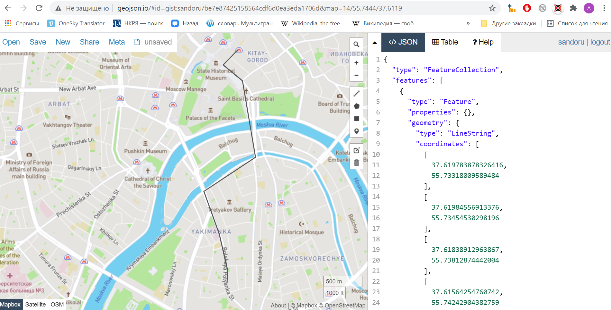

# homework
**Маршрут прогулки** от *дома творчества «На Полянке»* до *м. Площадь Революции*.
* Выход из ДТ
* Путь по Полянке
  * Игра в снежки в сквере
  * Покупка сидра
* Путь до моста с замками
* Путь вдоль реки
* Через мост к Красной площади
* Красная площадь
* Прощание у м. Площадь Революции

